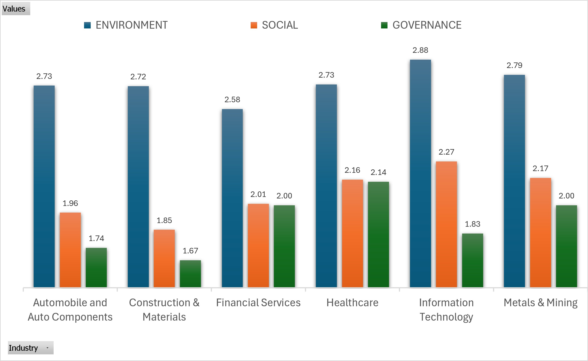
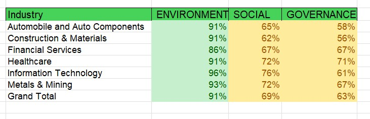
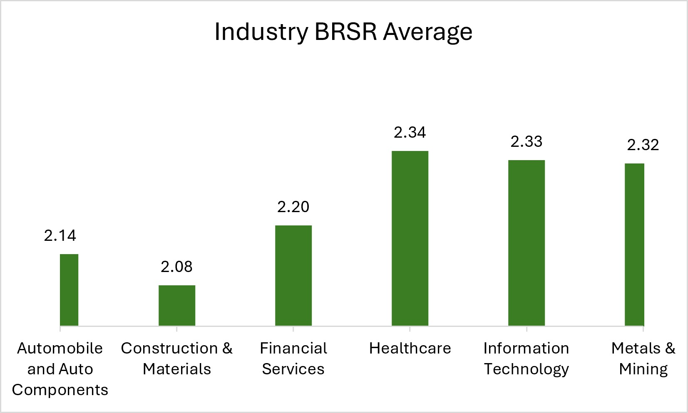

# ESG (BRSR) Disclosure Quality Benchmark

**Nifty 50 Companies-FY2024-25 & FY2025-26**
*Business Responsibility and Sustainability Reports is India's SEBI/BRSR  ESG regulatory framework*

> An Indian regulatory disclosure quality assessment. International framework alignment (GRI, IFRS S1/S2, TCFD) will be done later.[Roadmap](#8-roadmap-migration-to-international-esg-frameworks)-and is **not** to score any company in this version butanalyse the disclosure Quality.

**27 of the 50 Nifty 50 companies were benchmarked.** Industries with too few companies or highly diverse business models were excluded.


---

## Table of Contents

- [Executive Summary](#executive-summary)
- [1. The Indian Regulatory Basis for This Benchmark](#1-the-indian-regulatory-basis-for-this-benchmark)
- [2. Methodology](#2-methodology)
- [3. Company-Level Ranking](#3-company-level-ranking)
- [4. Industry-Wise Benchmark](#4-industry-wise-benchmark)
- [5. Cross-Cutting Disclosure Gaps](#5-cross-cutting-disclosure-gaps-mapped-to-brsr-principles-and-brsr-core-status)
- [6. Data Quality & Limitations](#6-data-quality--limitations)
- [7. Regulatory & Compliance Implications](#7-regulatory--compliance-implications)
- [8. Roadmap: Migration to International ESG Frameworks](#8-roadmap-migration-to-international-esg-frameworks)
- [Appendix A: Scoring Bands](#appendix-a-scoring-bands)
- [Appendix B: Key Regulatory References](#appendix-b-key-regulatory-references)
- [Appendix C: Methodology Appendix](#appendix-c-methodology-appendix)
---

## Executive Summary

TThis benchmark rates the depth and quality of Business Responsibility and Sustainability Report (BRSR) reporting disclosures across 27 Nifty 50 companies, representing six industry sectors (only sectors with at least three constituent companies were included, using a (0-3) scale per metric across the Environment, Social, and Governance pillars (where 0 = no disclosure, 3 = comprehensive disclosure with). Scores are expressed as a percentage of the maximum attainable for each metric.Every metric here is mapped under a specific BRSR reporting requirement under SEBI regulatory .
**Three findings are notable :**

- **Environmental disclosure is the strongest and most consistent pillar** (each industry sector average is 73–96%), and  6 of the 12 Environment metrics of analsyed data fall within SEBI's mandate **BRSR Core** attributes (GHG Footprint, Water Footprint, Energy Footprint, Embracing Circularity). The two important gaps -Scope 3 emissions and water-recycling % are the data metric that is not  universal and are applied conditionally.
- **Governance is the weakest and most uneven pillar** (48–72% by sector). This isn't conincidence: **none** of the 7 Governance metrics are BRSR Core attributes, BRSR Core's nine attributes lean towards Environment and Social (Workforce) metrics, leaving Governance metrics (anti-corruption policy, board ESG oversight, independent-director composition) governed only by the unmeasurable  "Essential Indicator" BRSR or by separate statutary mandate that this benchmark doesn't directly score.
- **Sector averages hide a lot of sector variance:** Healthcare contains both the top scorer oof this metric (Dr. Reddy's Laboratories, 95.1) and a bottom scorery (Apollo Hospitals Enterprise, 63.9). A sector-level BRSR score alone would misinterpret individual company disclosure gaps.

> **Scope note:** To ensure consistency and fairness, all companies were assessed using only their publicly available Business Responsibility and Sustainability Reports (BRSRs). Official NSE BRSR filings were used wherever available; otherwise, the BRSR report published on the company's official website was used. The benchmark assesses disclosure quality rather than the sustainability performance of the companies.

---

## 1. The Indian Regulatory Basis for This Benchmark

This benchmark in this assessmently scores companies **only against what Indian reualatory mandate and SEBI regulation currently require or encourage them to disclose in BRSR reporting only**

### 1.1 Statutory Foundation of BRSR

- **SEBI (LODR) Regulations, 2015 – Regulation 34(2)(f):** Requires the top 1,000 listed companies by market capitalisation to include a Business Responsibility and Sustainability Report (BRSR) in their annual report.

- **National Guidelines on Responsible Business Conduct (NGRBC), 2018:** Issued by the Ministry of Corporate Affairs (MCA), these nine principles form the foundation of the BRSR framework.

- **SEBI BRSR Core Circular (12 July 2023):** Introduced mandatory assurance for selected ESG attributes (BRSR Core) for applicable listed companies.

- **Companies Act, 2013 – Section 135 & Schedule VII:** Provides the legal basis for mandatory Corporate Social Responsibility (CSR) disclosures.

- **Companies Act, 2013 – Section 149 and SEBI LODR Regulation 17:** Set the requirements for board composition, including independent directors.

- **Industry ESG disclosures:** Introduced on a voluntary, comply-or-explain basis for the top 250 listed companies from FY2024–25.

### 1.2 The Nine NGRBC Principles Mapped to E, S and G
> **The National Guidelines on Responsible Business Conduct (NGRBC), issued by the Ministry of Corporate Affairs (MCA), the foundation of India's BRSR framework.**
| Principle | NGRBC Principle (summarised) | Primary Pillar |
|---|---|---|
| P1 | Ethics, Transparency & Accountability | Governance |
| P2 | Safety & sustainability of goods/services across the life cycle | Environment / Social |
| P3 | Well-being of employees, including value-chain workers | Social |
| P4 | Responsiveness to all stakeholders, especially disadvantaged/vulnerable groups | Social / Governance |
| P5 | Respect and promotion of human rights | Social |
| P6 | Protection and restoration of the environment | Environment |
| P7 | Responsible engagement in public/regulatory policy advocacy | Governance |
| P8 | Inclusive growth and equitable development | Social |
| P9 | Responsible engagement with consumers, providing value | Social / Governance |

### 1.3 BRSR Core: The Nine Assured Attributes and the Phase-In Schedule

SEBI's BRSR Core is a strict subset of full BRSR-nine attributes selected for mandatory reasonable assurance. This is structurally qauntative and hence, explains why Environment & Social metrics disclose more than Governance metrics: the former is far more regulatory mandate, than latter which is encouraged.

1. Greenhouse Gas (GHG) Footprint
2. Water Footprint
3. Energy Footprint
4. Embracing Circularity (waste management)
5. Enhancing Employee Wellbeing and Safety
6. Enabling Gender Diversity in Business
7. Enabling Inclusive Development
8. Fairness in Engaging with Customers and Suppliers
9. Openness of Business

**Phase-in schedule (by market-capitalisation rank):**

| Financial Year | BRSR Core Assurance Applies To | Note |
|---|---|---|
| FY2023-24 | Top 150 listed entities | Reasonable mandadory on BRSR Core attributes begins |
| FY2024-25 | Top 250 listed entities | Mandate expands; voluntary value-chain ESG disclosure (comply-or-explain) begins for Top 250 |
| FY2025-26 | Top 500 listed entities | Mandate expands (current reporting year for this benchmark) |
| FY2026-27 | Top 1,000 listed entities | Full BRSR Core coverage; Industry Mandate expected to begin |

*Source: SEBI Circular SEBI/HO/CFD/CFD-SEC-2/P/CIR/2023/122 dated 12 July 2023, and subsequent SEBI clarificatory circulars on value-chain disclosure and assurance ease-of-doing-business measures (2024–25).*

### 1.4 Why This Benchmark Stays India-First

Scoring only against BRSR's own required format and the BRSR Core KPI list keeps findings directly actionable for an Indian regulatory, board, or compliance audience: every gap in [Section 5](#5-cross-cutting-disclosure-gaps-mapped-to-brsr-principles-and-brsr-core-status) traces back to a specific NGRBC principle and, where relevant, its assurance status under the BRSR Core glide-path.

### 1.5 Note on International Alignment (Forward-Looking Only)

Many Nifty 50 companies already voluntarily cross-map BRSR disclosures to global frameworks-**GRI Standards**, **IFRS S1/S2 (ISSB)**, **TCFD** (now largely folded into ISSB), **SASB**, and the **UN SDGs**-particularly where they have foreign institutional investors or multinational reporting obligations. A full multi-framework crosswalk is the planned next phase of this benchmark-see [Section 8](#8-roadmap-migration-to-international-esg-frameworks).

---

## 2. Methodology

### 2.1 Rating Scale

Each disclosure metric is scored 0–3 against a fixed rubric:

| Score | Meaning |
|---|---|
| **0** | No disclosure |
| **1** | Narrative disclosure only (qualitative, no figures) |
| **2** | Basic quantitative disclosure (figures given, limited context) |
| **3** | Comprehensive disclosure (quantitative, contextualised, often externally assured) |

### 2.2 Scoring Formula

```
Pillar score (%) = (sum of metric ratings actually disclosed ÷ (metrics disclosed × 3)) × 100
Composite Score  = simple average of the three pillar percentages
```

Using the disclosed-metric count as the denominator (rather than a fixed denominator) avoids penalising a company twice for a missing data point-once as a 0, and again by shrinking its average. This matters most for Governance, which has several cells still pending third-party verification (see [Section 6](#6-data-quality--limitations)).

### 2.3 Coverage

27 of the Nifty 50 constituents have been rated to date, across six sectors: Financial Services, Information Technology, Healthcare, Automobile & Auto Components, Construction & Materials, and Metals & Mining. The remaining 23 constituents are **not yet rated** and are excluded rather than assumed to score zero.

---

## 3. Company-Level Ranking

Composite BRSR disclosure score, highest to lowest. Colour bands: 🟢 ≥85% (Leader) · 🟡 70–84% (Established) · 🟠 55–69% (Developing) · 🔴 <55% (Lagging)-see [Appendix A](#appendix-a-scoring-bands).

| Rank | Company | Industry | Env % | Social % | Gov % | Composite |
|---:|---|---|---:|---:|---:|---:|
| 1 | Dr. Reddy's Laboratories | Healthcare | 100.0 | 85.2 | 100.0 | 🟢 **95.1** |
| 2 | Cipla | Healthcare | 100.0 | 74.1 | 100.0 | 🟢 **91.4** |
| 3 | Tata Steel | Metals & Mining | 97.2 | 81.5 | 76.2 | 🟢 **85.0** |
| 4 | Infosys | Information Technology | 91.7 | 85.2 | 66.7 | 🟡 **81.2** |
| 5 | State Bank of India | Financial Services | 91.7 | 77.8 | 71.4 | 🟡 **80.3** |
| 6 | Tata Consultancy Services | Information Technology | 100.0 | 74.1 | 66.7 | 🟡 **80.2** |
| 7 | Tech Mahindra | Information Technology | 97.2 | 74.1 | 66.7 | 🟡 **79.3** |
| 8 | Wipro | Information Technology | 91.7 | 74.1 | 66.7 | 🟡 **77.5** |
| 9 | HCL Technologies | Information Technology | 100.0 | 75.0 | 50.0 | 🟡 **75.0** |
| 10 | Mahindra & Mahindra | Automobile and Auto Components | 88.9 | 70.4 | 61.9 | 🟡 **73.7** |
| 11 | JSW Steel | Metals & Mining | 100.0 | 70.4 | 47.6 | 🟡 **72.7** |
| 12 | Axis Bank | Financial Services | 83.3 | 70.4 | 61.9 | 🟡 **71.9** |
| 13 | Larsen & Toubro | Construction & Materials | 94.4 | 63.0 | 57.1 | 🟡 **71.5** |
| 14 | Maruti Suzuki | Automobile and Auto Components | 94.4 | 63.0 | 57.1 | 🟡 **71.5** |
| 15 | Tata Motors Passenger Vehicles | Automobile and Auto Components | 94.4 | 63.0 | 57.1 | 🟡 **71.5** |
| 16 | Grasim Industries | Construction & Materials | 94.4 | 63.0 | 57.1 | 🟡 **71.5** |
| 17 | Bajaj Auto | Automobile and Auto Components | 80.6 | 66.7 | 66.7 | 🟡 **71.3** |
| 18 | Sun Pharmaceutical Industries | Healthcare | 80.6 | 66.7 | 66.7 | 🟡 **71.3** |
| 19 | ICICI Bank | Financial Services | 75.0 | 66.7 | 71.4 | 🟡 **71.0** |
| 20 | Bajaj Finserv | Financial Services | 83.3 | 63.0 | 61.1 | 🟡 **69.1** |
| 21 | Max Healthcare Institute | Healthcare | 91.7 | 55.6 | 50.0 | 🟠 **65.7** |
| 22 | Adani Enterprises | Metals & Mining | 86.1 | 63.0 | 47.6 | 🟠 **65.6** |
| 23 | UltraTech Cement | Construction & Materials | 83.3 | 59.3 | 52.4 | 🟠 **65.0** |
| 24 | Hindalco Industries | Metals & Mining | 80.6 | 66.7 | 47.6 | 🟠 **64.9** |
| 25 | Eicher Motors | Automobile and Auto Components | 77.8 | 63.0 | 52.4 | 🟠 **64.4** |
| 26 | HDFC Bank | Financial Services | 80.6 | 44.4 | 66.7 | 🟠 **63.9** |
| 27 | Apollo Hospitals Enterprise | Healthcare | 75.0 | 66.7 | 50.0 | 🟠 **63.9** |

---

## 4. Industry-Wise Benchmark


The view most relevant to sector-level regulatory or policy targeting-it shows where an entire sector, not just a single company, is systematically weak.

| Industry | Env % | Social % | Gov % | Composite |
|---|---:|---:|---:|---:|
| Information Technology | 96.1 | 76.5 | 63.3 | **78.6** |
| Healthcare | 89.4 | 69.6 | 73.3 | **77.5** |
| Metals & Mining | 91.0 | 70.4 | 54.8 | **72.0** |
| Financial Services | 82.8 | 64.4 | 66.5 | **71.2** |
| Automobile and Auto Components | 87.2 | 65.2 | 59.0 | **70.5** |
| Construction & Materials | 90.7 | 61.7 | 55.6 | **69.3** |

Information Technology and Healthcare lead on composite score, driven mainly by strong Environment and Social disclosure. Metals & Mining ranks last overall despite reasonable Environment scores-its Governance disclosure (avg. 47.6–76.2%) is the weakest of any sector, a material finding given the sector's higher regulatory and community-impact exposure under environmental-clearance and pollution-control law, where governance transparency arguably matters most.

---

## 5. Cross-Cutting Disclosure Gaps, Mapped to BRSR Principles and BRSR Core Status

Averaging across all 27 companies by individual metric-rather than by company or sector-reveals which specific disclosure requirements are weak **system-wide**. Each metric is mapped to (i) its governing NGRBC Principle, and (ii) whether it sits inside SEBI's mandatorily-assured BRSR Core perimeter-the strongest single predictor, in this dataset, of how well a metric is disclosed.

### 5.1 Environment (NGRBC Principle 6)

| Metric | Avg (0–3) | NGRBC Principle / BRSR Core Status | Interpretation |
|---|---:|---|---|
| Water Recycled (%) | 🔴 1.41 | P6-Leadership indicator (voluntary), related to Water Footprint | Lowest environmental metric overall; even leaders rarely disclose water-circularity figures. |
| Scope 3 GHG Emissions | 🟠 1.59 | P6-Comply-or-explain only; GHG Footprint covers Scope 1 & 2 for assurance | Systemic gap-supply-chain emissions omitted even by companies with full Scope 1/2 assurance. |
| Net Zero Target | 🟡 2.48 | P6-Not a BRSR Core attribute; Leadership indicator only | Roughly a third of companies lack a stated or dated net-zero commitment. |
| Waste Recycled (%) | 🟢 2.85 | P6-BRSR Core: "Embracing Circularity" | Generally disclosed but often without a clear recycling-rate figure. |
| Renewable Energy (%) | 🟢 2.89 | P6-BRSR Core: "Energy Footprint" | Mostly disclosed; some gaps in share/target specificity. |
| Waste Generated | 🟢 2.96 | P6-BRSR Core: "Embracing Circularity" | Well disclosed across almost all companies. |
| Emission Intensity | 🟢 3.00 | P6-BRSR Core: "GHG Footprint" (Essential Indicator) | Consistently disclosed with year-on-year comparison. |
| Scope 1 GHG Emissions | 🟢 3.00 | P6-BRSR Core: "GHG Footprint" (mandatory reasonable assurance per band) | Universally disclosed with assurance. |
| Water Withdrawal | 🟢 3.00 | P6-BRSR Core: "Water Footprint" | Universally disclosed with assurance. |
| Total Energy Consumption | 🟢 3.00 | P6-BRSR Core: "Energy Footprint" | Universally disclosed with assurance. |
| Scope 2 GHG Emissions | 🟢 3.00 | P6-BRSR Core: "GHG Footprint" (mandatory reasonable assurance per band) | Universally disclosed with assurance. |
| External Assurance of Environmental Data | 🟢 3.00 | P6-Required under SEBI BRSR Core assurance glide-path | Universal-all companies obtain some form of assurance. |

### 5.2 Social (NGRBC Principles 3, 5, 8)

| Metric | Avg (0–3) | NGRBC Principle / BRSR Core Status | Interpretation |
|---|---:|---|---|
| Average Training Hours | 🔴 0.81 | P3-Not a BRSR Core attribute; Essential Indicator | Weakest Social metric overall; often omitted or given only as a placeholder. |
| Human Rights Policy | 🔴 1.26 | P5-Not a BRSR Core attribute; Essential Indicator | Frequently reduced to a policy statement without implementation detail. |
| Supplier ESG Assessment | 🟠 1.81 | P5-Related to voluntary Value Chain ESG disclosure (Top 250, comply-or-explain, FY2024-25+) | Patchy-many companies do not disclose supplier-level ESG screening. |
| Women Employees (%) | 🟠 2.04 | P3/P5-BRSR Core: "Gender Diversity in Business" | Disclosed, but rarely broken down by seniority or function. |
| Women on Board (%) | 🟠 2.11 | P1-Adjacent to Gender Diversity; board composition separately mandated under Companies Act s.149(1) | Disclosed as a headline number with limited trend data. |
| Community Investment / CSR | 🟡 2.26 | P8-Not a BRSR Core attribute; separately mandatory under Companies Act s.135 & Schedule VII | Generally disclosed given mandatory CSR-spend reporting in India. |
| Employee Turnover | 🟢 2.63 | P3-BRSR Core: "Employee Wellbeing and Safety" | Well disclosed across most companies. |
| Fatalities | 🟢 2.70 | P3-BRSR Core: "Employee Wellbeing and Safety" | Well disclosed, reflecting existing safety reporting norms. |
| Lost Time Injury Frequency Rate (LTIFR) | 🟢 2.78 | P3-BRSR Core: "Employee Wellbeing and Safety" | Well disclosed and comparable across companies. |

### 5.3 Governance (NGRBC Principle 1)

| Metric | Avg (0–3) | NGRBC Principle / BRSR Core Status | Interpretation |
|---|---:|---|---|
| Anti-corruption Policy | 🔴 1.30 | P1-Not a BRSR Core attribute; full-BRSR Essential Indicator only, no assurance mandate | Weakest Governance metric; policies referenced but rarely detailed. |
| Independent Directors (%) | 🔴 1.43 | P1-Governed separately by Companies Act s.149(4) & SEBI LODR Reg.17; not a BRSR Core attribute | Lowest-confidence metric-~48% of entries pending verification ("Review"). |
| ESG Governance at Board Level | 🟠 1.56 | P1-Not a BRSR Core attribute; Essential Indicator | Mixed-board oversight structure often unclear or generic. |
| Data Privacy & Cybersecurity Governance | 🟠 1.56 | P1/P9-Not a BRSR Core attribute; Leadership Indicator | Mixed-increasingly disclosed but inconsistently detailed. |
| Number of Corruption Cases | 🟠 1.81 | P1-Not a BRSR Core attribute; Essential Indicator | Often disclosed as zero without describing the monitoring mechanism. |
| Whistleblower Mechanism | 🟡 2.26 | P1-Not a BRSR Core attribute; Vigil Mechanism separately mandated under Companies Act s.177(9) & SEBI LODR Reg.22 | Reasonably well disclosed across most companies. |
| External ESG Assurance | 🟢 3.00 | P1-Required under SEBI BRSR Core assurance glide-path | Universal-all companies report some external assurance. |

> **Reading note:** *the Principle/Core-status mapping above reflects the general Essential-vs-Leadership structure and BRSR Core attribute list published by SEBI. It is provided at the level of rigor appropriate for a sector/portfolio benchmark; a company-specific compliance opinion should be verified against the  SEBI Annexure (BRSR Core format) and that company's own reporting-cycle applicability band.*

---

## 6. Data Quality & Limitations

- **Independent-director disclosure** was marked "Review" (unverified/pending) for 13 of 27 companies, concentrated in Financial Services, IT and Healthcare. Excluded from that company's Governance average rather than scored as 0 or full marks-treat sector Governance scores as a slight overestimate until verified against each company's Corporate Governance Report filed under SEBI LODR Schedule V.
- **One Social-metric cell** (HCL Technologies, Average Training Hours) was marked "R" pending restatement and excluded on the same basis.
- Scores reflect **disclosure quality and completeness**, not underlying ESG performance-a company can score highly for transparently reporting a poor number and score low for omitting a good one. This benchmark should not be read as an ESG performance rating.
- **23 of the 50 Nifty constituents are not yet rated**; sector and composite averages will shift, potentially materially, as coverage is completed.
- Where a company's official NSE/BSE BRSR filing could not be independently located, the BRSR published on the company's own investor-relations website was used instead; both sources are treated as equally authoritative, consistent with SEBI's requirement that the BRSR appear in the statutory annual report.

---

## 7. Regulatory & Compliance Implications

Framed for a regulatory, board-audit-committee, or ESG-compliance-function audience:

1. **Treat Governance as the priority remediation pillar, not Environment.** Because none of the seven Governance metrics benchmarked sit inside the assured BRSR Core perimeter, improvement here won't happen through the existing assurance glide-path alone-it requires the audit committee to independently mandate the same rigor (figures, not policy statements) already forced onto Environment data.
2. **Close the Scope 3 and water-recycling gap ahead of the FY2026-27 Top-1,000 deadline.** These are the two weakest Environment metrics (avg. 1.59 and 1.41 of 3) even among otherwise high-scoring companies-a reporting-obligation gap, not a capability gap, since the same companies fully disclose Scope 1/2.
3. **Prioritise third-party verification of Independent-Director and Anti-Corruption disclosures.** These carry the lowest Governance averages and the highest proportion of unverifiable ("Review") entries in this dataset, indicating self-attestation alone is currently insufficient.
4. **Introduce internal workforce-development disclosure norms ahead of any regulatory mandate.** Average Training Hours (0.81/3) and Human Rights Policy (1.26/3) are the weakest Social metrics economy-wide-an area current BRSR guidance treats lightly relative to safety metrics (LTIFR, Fatalities), which score well  because they sit inside the BRSR Core Employee Wellbeing and Safety attribute.

---

## 8. Roadmap: Migration to International ESG Frameworks

This version of the benchmark is intentionally India-first. The following is a brief forward-looking note only-**no scoring against these frameworks has been performed in this version**.

- **GRI Standards**-the most widely adopted global sustainability reporting standard; BRSR's Environment and Social indicators already substantially overlap with core GRI disclosures, making a GRI crosswalk the lowest-effort next step.
- **IFRS S1 / S2 (ISSB)**-the emerging global baseline for investor-grade sustainability and climate disclosure; increasingly referenced by FPI/FII investors in Nifty 50 companies.
- **TCFD**-climate-risk governance and scenario-disclosure recommendations, now substantially absorbed into IFRS S2.
- **SASB**-industry-specific materiality metrics, useful for the sector-level view in [Section 4](#4-industry-wise-benchmark).
- **UN Sustainable Development Goals (SDGs)**-many Indian companies already map CSR and inclusive-growth (NGRBC P8) disclosures to specific SDGs voluntarily.

**Planned next phase:** a metric-by-metric crosswalk table (BRSR Principle ⇄ GRI Standard ⇄ IFRS S1/S2 disclosure requirement) so the same underlying company data in this benchmark can be re-expressed for an international audience without re-collecting source data.

---

## Appendix A: Scoring Bands

| Band | Score | Meaning |
|---|---|---|
| 🟢 Leader | 85–100% | Comprehensive, assured disclosure across nearly all metrics |
| 🟡 Established | 70–84% | Solid quantitative disclosure with some gaps |
| 🟠 Developing | 55–69% | Mixed narrative/quantitative disclosure, notable gaps |
| 🔴 Lagging | Below 55% | Significant disclosure gaps across multiple metrics |

## Appendix B: Key Regulatory References

- SEBI (Listing Obligations and Disclosure Requirements) Regulations, 2015-Regulation 34(2)(f) (BRSR mandate) and Regulation 17 (independent directors)
- SEBI Circular SEBI/HO/CFD/CFD-SEC-2/P/CIR/2023/122, dated 12 July 2023 (BRSR Core, value-chain ESG disclosure and assurance)
- SEBI Notification SEBI/LAD-NRO/GN/2023/131, dated 14 June 2023 (BRSR format amendment)
- National Guidelines on Responsible Business Conduct, 2018-Ministry of Corporate Affairs
- Companies Act, 2013-s.135 & Schedule VII (CSR); s.149(4) (independent directors); s.149(1) proviso (woman director); s.177(9) (vigil mechanism)
- Companies (Corporate Social Responsibility Policy) Rules, 2014

- 
## Appendix C: Methodology Appendix
## Environment

| # | Metric | Why It Matters | BRSR Mandatory Requirement | RDB (0–3) | Industry Applicability |
|---|---|---|---|---|---|
| 1 | Scope 1 GHG Emissions | Direct emissions | Mandatory disclosure of Scope 1 emissions, prescribed emission intensity, calculation methodology, standards and assumptions. | 3 | Universal |
| 2 | Scope 2 GHG Emissions | Purchased electricity emissions | Mandatory disclosure of Scope 2 emissions, prescribed emission intensity, methodology and calculation basis. | 3 | Universal |
| 3 | Scope 3 GHG Emissions | Supply chain impact (often largest) | Mandatory disclosure of total Scope 3 emissions with methodology and emission factors. Voluntary elements excluded from scoring. | 2 | Conditional-applicable where Scope 3 emissions are material |
| 4 | Emission Intensity | Fair comparison across company sizes | Mandatory disclosure of emission intensity per turnover. Additional ratios are voluntary. | 2 | Universal |
| 5 | Total Energy Consumption | Operational efficiency | Mandatory disclosure of total energy consumption. | 2 | Universal |
| 6 | Renewable Energy (%) | Energy transition | Mandatory disclosure of renewable energy consumed and share in total energy consumption. | 2 | Universal |
| 7 | Water Withdrawal | Resource use | Mandatory disclosure of water withdrawn by source. | 2 | Conditional-primarily relevant to water-intensive industries; service entities may disclose "Not Applicable" with justification where permitted |
| 8 | Water Recycled (%) | Water management | Mandatory disclosure of water recycled/reused where applicable. | 2 | Conditional-particularly relevant for manufacturing, utilities, mining, chemicals, metals, food processing and pharma |
| 9 | Waste Generated | Operational impact | Mandatory disclosure of waste generated by category. | 2 | Universal |
| 10 | Waste Recycled (%) | Circular economy | Mandatory disclosure of recycled/recovered waste. | 2 | Conditional-some sectors may report "Not Applicable" for specific waste streams with justification |
| 11 | Net Zero Target | Long-term climate commitment | No mandatory requirement under BRSR. | 0 | Universal (Not Mandatory) |
| 12 | External Assurance of Environmental Data | Credibility | Mandatory disclosure of whether external assurance has been obtained and the assurance provider. | 2 | Universal |

## Social

| # | Metric | Why It Matters | BRSR Mandatory Requirement | RDB (0–3) | Industry Applicability |
|---|---|---|---|---|---|
| 1 | Women Employees (%) | Workforce diversity | Mandatory disclosure of workforce composition, including women employees. | 2 | Universal |
| 2 | Women on Board (%) | Governance diversity | Mandatory disclosure of women directors as part of governance and workforce disclosures. | 2 | Universal |
| 3 | Employee Turnover | Workforce stability | Mandatory disclosure of employee turnover by category. | 2 | Universal |
| 4 | Average Training Hours per Employee | Human capital investment | Mandatory disclosure of average training hours per employee category. | 2 | Universal |
| 5 | Lost Time Injury Frequency Rate (LTIFR) | Worker safety | Mandatory disclosure of LTIFR for employees and workers. | 2 | Universal |
| 6 | Fatalities | Critical safety indicator | Mandatory disclosure of work-related fatalities for employees and workers. | 2 | Universal |
| 7 | Human Rights Policy | Responsible business | Mandatory disclosure regarding human rights commitments, policies and grievance mechanisms where prescribed. | 1 | Universal |
| 8 | Supplier ESG Assessment | Supply chain responsibility | Mandatory disclosure of ESG assessment of suppliers under responsible sourcing indicators. | 2 | Conditional-primarily applicable to entities with procurement or supply-chain operations; asset-light service entities may disclose limited or "Not Applicable" information with justification where appropriate |
| 9 | Community Investment / CSR | Social impact | Mandatory disclosure of CSR expenditure and community development initiatives where Companies Act CSR provisions apply. | 2 | Conditional-applicable to entities covered under the Companies Act CSR provisions; others may report as not applicable where legally exempt |

## Governance

| # | Metric | Why It Matters | BRSR Mandatory Requirement | RDB (0–3) | Industry Applicability |
|---|---|---|---|---|---|
| 1 | Independent Directors (%) | Board independence | Mandatory disclosure of Board composition, including the number and proportion of independent directors. | 2 | Universal |
| 2 | ESG Governance at Board Level | Strategic oversight | Mandatory disclosure of Board oversight, governance structure, responsibility for sustainability issues, and implementation processes. | 1 | Universal |
| 3 | Anti-corruption Policy | Ethical governance | Mandatory disclosure regarding anti-bribery/anti-corruption policies, governance mechanisms, and implementation. | 1 | Universal |
| 4 | Whistleblower Mechanism | Transparency | Mandatory disclosure of grievance/whistleblower mechanisms and processes available to employees and stakeholders. | 1 | Universal |
| 5 | Number of Corruption Cases | Governance effectiveness | Mandatory disclosure of confirmed incidents, disciplinary actions and legal cases relating to corruption/bribery, where applicable. | 2 | Conditional-applicable where incidents exist; if no cases occurred, entities disclose Nil/Zero, not "Not Applicable" |
| 6 | Data Privacy & Cybersecurity Governance | Modern governance risk | Mandatory disclosure regarding data privacy, cybersecurity governance, customer complaints/breaches where prescribed. | 2 | Universal |
| 7 | External ESG Assurance | Reliability of disclosures | Disclosure of whether the BRSR/Core disclosures have been subjected to independent external assurance, including the scope and assurance provider, where applicable. | 2 | Universal |

---

*This document is a disclosure-quality benchmark prepared from publicly available BRSR filings. It does not constitute legal advice, an assurance opinion, or an investment recommendation. Company scores are current as of the data-collection date noted above and are subject to revision as further Nifty 50 constituents are rated.*


